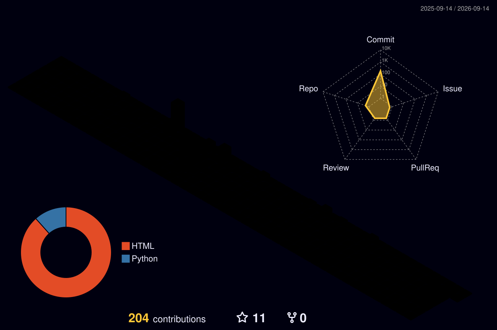

<div align="center">


<h1>Mobilis In Mobili</h1>

<p>
  <strong>Quantitative Trader · Blockchain · Security · AI</strong>
</p>

<p>
  <em>mobilis in mobili.</em>
</p>

<p>
  <a href="https://justloseit.top/">
    
  </a>
  <a href="mailto:hang_ruan@foxmail.com">
    
  </a>
  <a href="https://justloseit.top/atom.xml">
    
  </a>
  <a href="https://github.com/MobillsInMobild">
    
  </a>
</p>

</div>

<br />

<div align="center">
  
</div>

<br />

## IDENTITY // 01

```text
> whoami
```

* 💼 Quantitative trader
* 🎓 M.S. & B.S. in Engineering @ **BUAA**
* 🔗 Research background in **blockchain**, including cross-chain protocols, consensus and light clients
* ⚡ Interested in **Crypto · DeFi · MEV · Market Infrastructure**
* 🤖 Exploring **AI · LLM Agents · Document Intelligence**
* 😼 Former CTFer — especially interested in puzzles and miscellaneous challenges
* 🔧 I enjoy building, breaking, repairing and understanding systems

<br />

## Tech // 02

<div align="center">
<br />


<br />
<br />


<br />
<br />

<sub>
SYSTEMS ONLINE · LOW LEVEL · AUTOMATION · INFRASTRUCTURE
</sub>

<br />
<br />
<br />


<br />
<br />


<br />


<br />
<br />

<sub>
CONSENSUS · CROSS-CHAIN · SMART CONTRACTS · DEFI · MEV
</sub>

<br />
<br />
<br />


<br />
<br />


<br />


<br />
<br />

<sub>
DATA · RESEARCH · MARKET INFRASTRUCTURE · ANALYTICS
</sub>

<br />
<br />
<br />


<br />
<br />


<br />
<br />

<sub>
LLM AGENTS · RAG · VISION · DOCUMENT AI · RUST
</sub>

<br />


</div>


## Latest Writing // 03

<div align="center">


<br />
<br />

<sub>
LATEST SIGNALS RECEIVED FROM THE MOBILIS NETWORK
</sub>

</div>

<br />

<table>
  <thead>
    <tr>
      <th width="70" align="center">ID</th>
      <th width="130" align="center">DATE</th>
      <th>TRANSMISSION</th>
    </tr>
  </thead>
  <tbody>
<!-- BLOG-POST-LIST:START --><tr><td align="center"><code>#1</code></td><td align="center"><code>2026-05-19</code></td><td>📄 <a href="https://justloseit.top/%E4%B8%80%E4%BA%9B%E5%85%B3%E4%BA%8EAI%E7%9A%84%E5%91%93%E8%AF%AD/"><strong>一些关于 AI 的呓语</strong></a></td></tr>
<tr><td align="center"><code>#2</code></td><td align="center"><code>2026-02-16</code></td><td>📄 <a href="https://justloseit.top/%E5%B9%B4%E5%BA%A6%E6%80%BB%E7%BB%93%EF%BC%9A2025%E5%B9%B4%E6%88%91%E7%9A%84%E9%98%85%E8%AF%BB%C2%B7%E5%BD%B1%E8%A7%86%C2%B7%E6%B8%B8%E6%88%8F/"><strong>年度总结：2025年我的阅读·影视·游戏</strong></a></td></tr>
<tr><td align="center"><code>#3</code></td><td align="center"><code>2026-02-09</code></td><td>📄 <a href="https://justloseit.top/Kindle%20Keyboard%20%E5%88%B7%E6%9C%BA%20KOReader/"><strong>Kindle Keyboard 刷机 KOReader</strong></a></td></tr>
<tr><td align="center"><code>#4</code></td><td align="center"><code>2026-01-03</code></td><td>📄 <a href="https://justloseit.top/%E5%B9%BF%E5%B7%9E%E9%95%BF%E9%9A%86%E5%8A%A8%E7%89%A9%E5%9B%AD%E5%9B%BE%E9%9B%86/"><strong>广州长隆野生动物园记录</strong></a></td></tr>
<tr><td align="center"><code>#5</code></td><td align="center"><code>2025-12-13</code></td><td>📄 <a href="https://justloseit.top/%E6%95%B0%E6%8D%AE%E7%9E%B0%E5%BD%B1%EF%BC%9A2025%E5%B9%B4Audubon%E6%91%84%E5%BD%B1%E5%A5%96Top100/"><strong>数据瞰影：2025 年 Audubon 摄影奖 Top100</strong></a></td></tr>
<!-- BLOG-POST-LIST:END -->
  </tbody>
</table>

<div align="center">

<br />

<a href="https://justloseit.top/">
  
</a>

<br />
<br />

</div>

<br />


<br />

## Contribution // 04

<div align="center">

<picture>
  <source
    media="(prefers-color-scheme: dark)"
    srcset="./profile-3d-contrib/profile-night-rainbow.svg"
  />
  <source
    media="(prefers-color-scheme: light)"
    srcset="./profile-3d-contrib/profile-season.svg"
  />
  
</picture>

</div>

<br />


<div align="center">

<picture>
  <source
    media="(prefers-color-scheme: dark)"
    srcset="https://raw.githubusercontent.com/MobillsInMobild/MobillsInMobild/output/github-contribution-grid-snake-dark.svg"
  />
  <source
    media="(prefers-color-scheme: light)"
    srcset="https://raw.githubusercontent.com/MobillsInMobild/MobillsInMobild/output/github-contribution-grid-snake.svg"
  />
  
</picture>

</div>

<br />

---

<div align="center">

```text
mobilis@github:~$ Per Aspera Ad Astra _
```

<a href="https://justloseit.top/">
  
</a>
<a href="mailto:hang_ruan@foxmail.com">
  
</a>
<a href="https://justloseit.top/atom.xml">
  
</a>

<br />
<br />


</div>
